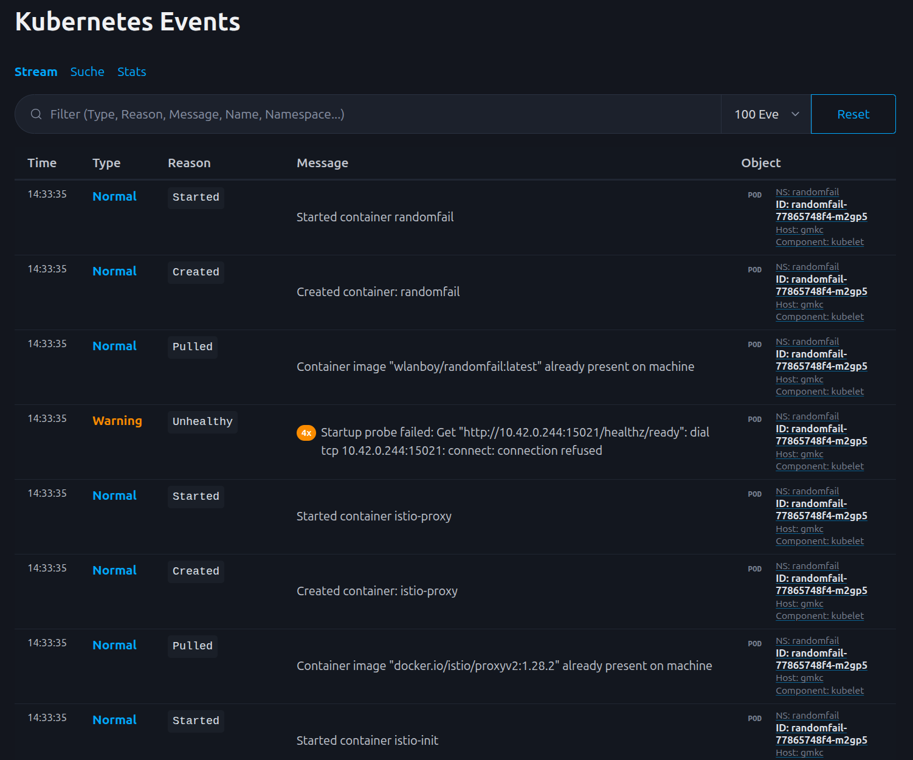

# Kubernetes Event Dashboard
A lightweight, real‑time dashboard for collecting, storing, searching, and visualizing Kubernetes Events. This project provides:

A FastAPI backend that watches Kubernetes events, stores them in a database, and exposes REST + SSE endpoints
A minimal frontend for live event streaming, searching, filtering, and pagination
Prometheus metrics for monitoring event activity
A clean, self‑contained solution for debugging clusters and understanding workload behavior


Java version of https://github.com/wlanboy/kubeevent

## Features
### Real‑time Event Stream
- Uses Kubernetes’ watch API
- Streams events via Server‑Sent Events (SSE)
- Client‑side filtering (type, reason, message, namespace, involved object)

### Prometheus Metrics
Exposes /metrics with:
- Events by type (Normal, Warning, Error)
- Events by workernode, kubelet, scheduler, controller
- Events by namespace, deployment, pod

### Persistent Storage
- Stores all events in a SQLModel/SQLite (or any SQLModel‑compatible DB)
- Prevents event loss
- Allows historical search

## Architecture Overview
```
+-------------------+        +---------------------+
| Kubernetes API     | ----> | FastAPI Watcher     |
| (Events)           |       | (k8s_watcher.py)    |
+-------------------+        +---------------------+
                                    |
                                    v
                           +------------------+
                           | SQLModel Storage |
                           +------------------+
                                    |
                                    v
+-------------------+        +---------------------+
| Frontend (HTML/JS)| <----> | FastAPI REST + SSE  |
| Live Stream + UI  |        | /events/stream      |
+-------------------+        | /events/search      |
                             | /metrics            |
                             +---------------------+
```

## Start service
```bash
mkdir data
mvn spring-boot:run
```

## Docker build and run
```bash
docker build -t kubeevent:latest .

docker run --rm --name kubeeventjava \
  -p 8080:8080 \
  -v $(pwd)/data:/app/data \
  -e DB_PATH="jdbc:h2:file:/app/data/events;DB_CLOSE_DELAY=-1;NON_KEYWORDS=count" \
  -e POD_NAMESPACE="kubeeventjava,simpleservice,randomfail" \
  kubeevent:latest
```

## Run service in cluster
```bash
cd kubeevent-chart
helm install kubeevent . -n kubeevent --create-namespace

cd ..

POD=$(kubectl get pod -n kubeeventjava -l app=kubeeventjava -o jsonpath='{.items[0].metadata.name}')

curl -fsSL https://raw.githubusercontent.com/metalbear-co/mirrord/main/scripts/install.sh | bash

mirrord exec -t pod/$POD -n kubeeventjava -- mvn spring-boot:run
```

## Create Events
```bash
kubectl create deployment demoapp -n kubeeventjava --image=nginx
kubectl scale deployment demoapp -n kubeeventjava --replicas=2
kubectl scale deployment demoapp -n kubeeventjava --replicas=0
kubectl delete deployment demoapp -n kubeeventjava
```
